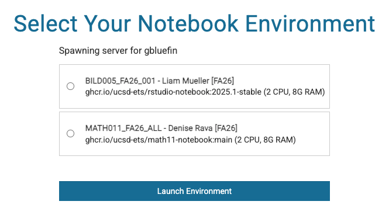

# Datahub in the Browser

[datahub.ucsd.edu](https://datahub.ucsd.edu) provides browser-based access to
course environments. It requires a browser, UCSD campus credentials, and Duo;
no local installation or command-line experience is needed.

## Signing In

1. Open [datahub.ucsd.edu](https://datahub.ucsd.edu).
2. Sign in through **UCSD single sign-on**, with campus credentials.
3. Approve the Duo prompt.

Datahub uses the standard campus sign-on, the same one used by other UCSD
services. Nothing Datahub-specific is entered at sign-in. An account that cannot
get past the campus sign-in page has a credential problem, not a Datahub
problem, and the [ITS Service Desk](https://support.ucsd.edu/) handles it.

The Active Directory username is required at a different prompt, `ssh` to the
login node, which does not accept the full address.
[Connecting over SSH](the-login-node.md#connecting-over-ssh) describes that
prompt.

## Selecting a Course & Environment

After sign-in, Datahub lists the courses available to the account and, within a
course, the environments configured for it.

### Course List

Each Datahub course appears separately and holds its own files. Students and
instructors enrolled in more than one course select among them in this list.
[Belonging to Several Workspaces](../workspaces-and-storage/what-a-workspace-is.md#belonging-to-several-workspaces)
describes membership in more than one workspace.

### Environment Menu

The options in the environment menu are set by the course instructor. The menu
commonly holds one CPU option, and a GPU option in courses that use GPUs.
Environments not present in the menu are added by the instructor.
[What a Workspace Is and What It Controls](../workspaces-and-storage/what-a-workspace-is.md)
describes the settings a course workspace controls.

### Startup Time

An environment takes one to two minutes to start, and longer while the cluster
is busy. The live state of the cluster is shown on the status page. See
[The Status Page](../gpu-access/quotas-and-availability.md#the-status-page).

## The Browser Session

By default, a browser session starts with 2 CPU cores and 4 GB of RAM. This is
the course spawn configuration, set per course, and a course can configure
more. The environment menu shows each option's size. The defaults applied by
the command-line launch scripts are a separate figure that describes a
different object. See
[Working from the Command Line](../working-from-the-command-line.md).

A session provides JupyterLab, with notebooks, a file browser, a text editor,
and a terminal. Files persist between sessions.
[Customizing an Environment](../environments/customizing-your-environment.md)
describes installing software within an environment, and the conditions under
which an installation persists.

## Concurrent Datahub Sessions

A member may have one Datahub session running at a time. The limit applies to
Datahub itself, and it counts sessions, not environments or courses. Working in
a different course environment requires stopping the running session first. See
[Stopping a Session](#stopping-a-session).

### Shell, VS Code, and Batch Jobs

The one-session limit does not extend to work launched from a shell. SSH
sessions, VS Code containers, and batch jobs run alongside a Datahub session,
and alongside each other, in any number. Launching a container from
`dsmlp-login` while a browser session is open is ordinary use and does not
conflict with the session.

### Aggregate Resource Limits

Total CPU, memory, and GPU across everything a member has running must fit
within the Kubernetes limits set on the member's namespace and, where GPUs are
involved, within the reservation system's limits. A launch is refused when the
total would exceed them, whatever mix of sessions makes up that total.
[Running Several Jobs at Once](../running-jobs/job-modes-and-limits.md#running-several-jobs-at-once)
describes running several jobs together.

## Stopping a Session

> [!WARNING]
> Signing out does not stop a session, and neither does closing the browser
> tab. The container continues to run and holds its CPU, its memory, and its
> GPU where one is attached.

To stop a session, use **File → Hub Control Panel → Stop My Server**. The
interface may take a short time to reflect the change.

### Stopping an Unreachable Session

Where the browser session cannot be reached at all, as with a stale profile or
a page that will not load, the **manual-resetter** under the services dropdown
at [datahub.ucsd.edu](https://datahub.ucsd.edu) stops any running servers and
resets the profile, leaving files untouched. The procedure is in
["Spawn Failed"](sign-in-and-session-problems.md#spawn-failed).

## Status & Quota Pages

Two pages at datahub.ucsd.edu report storage use and cluster capacity.

| Page | Location | Contents |
|---|---|---|
| Disk usage | [datahub.ucsd.edu/hub/spawn](https://datahub.ucsd.edu/hub/spawn) → **Services** tab → **disk-quota-service** | Storage in use against the account quota |
| Cluster status | [datahub.ucsd.edu/hub/status](https://datahub.ucsd.edu/hub/status) | Cluster nodes, the GPU models on them, and free GPU counts |

> [!WARNING]
> A full quota prevents a session from starting and produces no error message.

[Workspace and Personal Quotas](../workspaces-and-storage/your-files-and-quotas.md#workspace-and-personal-quotas)
describes the storage pools and their quotas.
See [The Status Page](../gpu-access/quotas-and-availability.md#the-status-page).

See also: [Recovering from a Full Quota](../workspaces-and-storage/your-files-and-quotas.md#recovering-from-a-full-quota)

## Sign-In Failures

Most failures to reach a session resolve to one of these conditions:

- The course does not appear in the course list.
- The disk quota is full, or a package in `.local` breaks the environment.
- The cluster is busy, or the environment's image is slow to download.

[Sign-In & Session Problems](sign-in-and-session-problems.md) covers each
condition.
