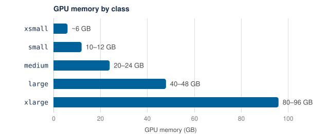

# GPU Classes

A **GPU class** is a size band of GPU memory rather than a hardware model: a
request names the amount of GPU memory the work needs, and the platform selects
the physical card that provides it.

## GPU Class Sizes

| Class | Memory | Typically backed by |
|---|---|---|
| `xsmall` | ~6 GB | A slice of an A30 |
| `small` | 10-12 GB | RTX 2080 Ti, or a slice of an A30 or H100 |
| `medium` | 20-24 GB | A30, A5000, Titan RTX, or a slice of an H100 or RTX PRO 6000 |
| `large` | 40-48 GB | L40S, or a slice of an H100 or RTX PRO 6000 |
| `xlarge` | 80-96 GB | A full H100 or RTX PRO 6000 Blackwell |



Plan against the memory column. The hardware column is context. Both columns
are approximate and subject to change. A class specifies roughly how much GPU
memory a session has, not which card it runs on, and two sessions in the same
class on the same afternoon may run on different hardware.
[Workloads by GPU Class](workloads-by-gpu-class.md) lists every card and slice
that can back each class, and [GPU Hardware & CUDA](gpu-hardware.md) gives their
specifications.

## Choosing a Class

Request the smallest class the work fits within. A larger class is not faster
for a model that already fits in a smaller one. A larger class is scarcer, so
the wait for it is longer, and it draws more heavily on the Service Unit budget
for every hour it is held. See
[Service Units & Budgets](service-units-and-budgets.md).

GPU memory, not speed, determines the class. A model's parameters, its
optimizer state, and the activations for one batch must all fit on the card at
once. A run that fails with a CUDA out-of-memory error has two usual remedies,
applied in this order: a smaller batch size, then the next class up.

[Workloads by GPU Class](workloads-by-gpu-class.md) gives examples of course and
research work that fits each class, with approximate memory figures.

### Multiple GPUs

One GPU is the normal case. Single-GPU work mostly consists of moving a model
and its batches onto the device. Using several GPUs at once is a substantial
code change rather than a launch flag. In PyTorch, this means
`nn.parallel.DistributedDataParallel` or a library such as Hugging Face
Accelerate.

An account can hold 1 GPU at a time by default, whatever it has booked; see
[Resource Tiers](../running-jobs/launch-sh-reference.md#resource-tiers). For
multi-GPU work, the member, or a TA for a course, asks ITS to raise the
account's limit. Requests go to [datahub@ucsd.edu](mailto:datahub@ucsd.edu) and
state what the work is.

## Requesting a Class

A GPU launch requests two things: the number of GPUs and the class.

```bash
launch-scipy-ml.sh -W DSC40_FA26_001 -g 1 -l gpu-class=medium
```

`-g` sets the GPU count and `-l gpu-class=` sets the class. The five values are
`xsmall`, `small`, `medium`, `large`, and `xlarge`. Always pass the
class label on a GPU request. A GPU request without it cannot be scheduled. See
[Missing or Misspelled Class Label](#missing-or-misspelled-class-label).

> [!NOTE]
> `-g` is the GPU count and `-G` is the group flag. Typing `-G` in place of
> `-g` produces an error that does not clearly indicate the capitalization
> mistake. See [Resource and GPU Selection Flags](../running-jobs/launch-sh-reference.md#resource-and-gpu-selection-flags).

### Service Unit Charges at Launch

> [!WARNING]
> Launching a GPU session without a booking creates a reservation on the
> member's behalf and draws Service Units in the same way as a booked window.
> There is no free exploratory launch. See
> [On-Demand Lease Charges](service-units-and-budgets.md#on-demand-lease-charges).

A launch without a booking holds an on-demand lease of 1 hour 10 minutes, and
is charged for the time the session uses within it. A longer guarantee comes
from [Extend](reservations.md#extend) in the reservation app. A session must be
stopped explicitly. Logging out does not stop it. See
[Stopping a Session](../access/datahub-in-the-browser.md#stopping-a-session).

### Workspace Class Grants

Each workspace is granted access to one or more classes, chosen when the
workspace was provisioned to match the work it was expected to do. An
introductory course may see `small` or `medium`. A lab fine-tuning large models
may see `xlarge`. A request for a class the workspace was not granted is
refused, however idle the hardware is. Access to a further class is requested
by the instructor or PI. The grant is part of the workspace. See
[What a Workspace Is and What It Controls](../workspaces-and-storage/what-a-workspace-is.md).

A member who belongs to several workspaces selects the one a launch goes into
with `-W`. See
[Belonging to Several Workspaces](../workspaces-and-storage/what-a-workspace-is.md#belonging-to-several-workspaces).
The launch uses that workspace's class grant and Service Unit budget. A GPU
launch without `-W` is charged to `ORG_ON_DEMAND`; see
[The Default Workspace](reservations.md#the-default-workspace).

### Requesting a GPU Model

`-v <model>` limits a GPU session to one model within its class, for example
`-l gpu-class=large -v l40s`. The class label is still needed, and the model
must be one that backs the class in [GPU Class Sizes](#gpu-class-sizes). Use
`-v` only for a session launched without a booking; see
[Node Selection](../running-jobs/launch-sh-reference.md#node-selection).

### Slurm Partition Mapping

`--partition` is not a scheduling partition on this platform. It is forwarded
as a `gpu-class` label, so `--partition medium` requests the `medium` class.
The mapping of Slurm options is under
[Option Mapping](../reference/coming-from-hpc.md#option-mapping).

## Preset Classes on Datahub

A browser session has no GPU class to choose. The class is set on the
environment a workspace publishes and is fixed in whichever profile is selected
from the spawn menu. There is no control to change it.

Where a course offers both a CPU option and a GPU option, selecting the GPU
option also selects its class. Work that needs a different class from the one a
course publishes is arranged with the instructor or TA. Where a course does not
publish a GPU environment, the same access can be used from the command line.
See [Working from the Command Line](../working-from-the-command-line.md).

## Missing or Misspelled Class Label

Every GPU class is managed by the reservation system, and a GPU pod waits in
`Pending` until the reservation system admits it. While it waits,
`kubectl describe pod` shows a `FailedScheduling` event from the Kubernetes
scheduler that begins `0/N nodes are available`. That event is normal for every
GPU pod that has not been admitted yet. It does not by itself mean that
the label is wrong or that the cluster is full.

Read the events from `gpu-reservation-controller` beside it:

| What `kubectl describe pod` shows | Cause | Fix |
|---|---|---|
| An `UnknownGpuClass` event, which lists the known classes | The class name is misspelled. Class names are case-sensitive | Delete the pod and launch again with the correct name |
| No event from `gpu-reservation-controller` after a minute or two, and no `gpu-class` under **Labels** | The label is missing. The reservation system never sees the pod | Delete the pod and launch again with `-l gpu-class=<class>` |
| Any other reservation event | The reservation system is handling the pod | See [Reservation Events](../reference/reservation-events.md) |

[When the Cluster Is Full](quotas-and-availability.md#when-the-cluster-is-full)
covers a full cluster. [Error Messages](../reference/error-messages.md) also
lists the messages.

## Confirming the Allocation

Two commands, run inside the running container, confirm what was allocated.

```bash
python -c "import torch; print(torch.cuda.get_device_name(0));"
nvidia-smi
```

Run the first command when code reports that no device was found. That symptom
is more often an environment problem than a scheduling one. For example, an
image without CUDA tooling cannot see a card that is attached. The
`rstudio-notebook` image derives from the CPU image and is not GPU-enabled. See
[Standard Images](../environments/standard-images.md#standard-images).
[PyTorch GPU Detection](../reference/error-messages.md#pytorch-gpu-detection)
lists the usual causes.

The second command, `nvidia-smi`, names the GPU model and how much memory it
has. This confirms that the session is on the expected class rather than an
adjacent one. A session on a Multi-Instance GPU (MIG) slice can use only the
slice's memory, which is less than the card's; see
[MIG Slices](gpu-hardware.md#mig-slices).

The status page lists the GPU models present on each node, and how many are
free. See [The Status Page](quotas-and-availability.md#the-status-page).

### Checking GPU Utilization

`nvidia-smi` also reports what is currently using the card. This shows whether
a training run is on the GPU or running on the CPU instead. Check it once at
the start of a long run. A GPU that is not in use is reclaimed by idle culling,
which applies to every class, with or without a reservation. The criteria are
under [What Counts as Idle](what-ends-a-session.md#what-counts-as-idle).

## From Reservation to Running Session

A reservation guarantees access, not a running job. Booking a window does not
start anything. When the window opens, a session is launched the usual way. The
booking ensures that the capacity is available and that the session is
admitted ahead of the walk-up queue.

There is no control that selects a booking. A session that matches the booking,
by user, class, workspace, and GPU count, claims it; see
[Claiming a Booking](reservations.md#claiming-a-booking). A session of a
different class does not claim the booking, and is given an on-demand lease
instead.

A booked window that is not claimed in time is cancelled. The deadline is under
[The Claim Window](reservations.md#the-claim-window).
